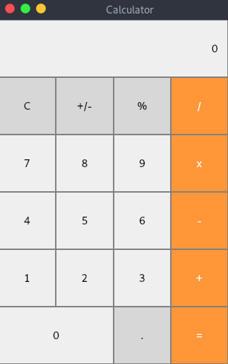

# Ti_SimpleCalculator
This is a basic <b>PyQt</b> based simple calculator.
---

 Simple Calculator 

## Linux based OS

### Clone repository:
* Run `git clone https://github.com/tivole/Ti_SimpleCalculator.git` to clone repository.

### Make sure you have installed:
* <b>Python</b> (3.6 or above recommended)
* <b>Pip</b> (18.1 or above recommended)

### Virtual environment:
* Run `python3 -m venv venv` to create virtual environment.
* Run `source venv/bin/activate` to activate venv.
* Run `pip3 install pyqt5` to install PyQt5.

### Running Calculator:
* Run `cd Ti_SimpleCalculator/src` to change directory.
* Run `python main.py` to run calculator.

## Screenshots
